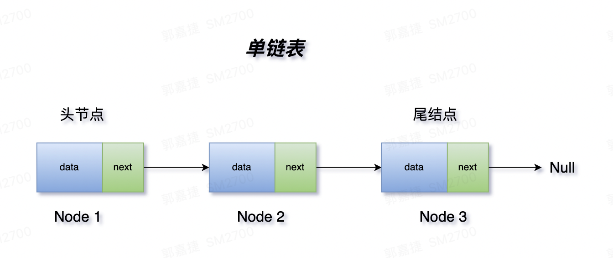
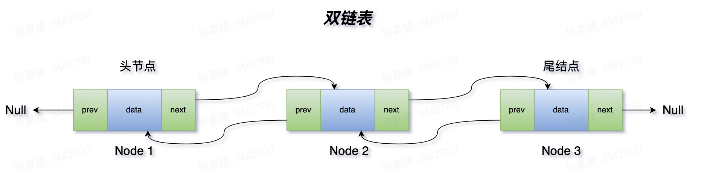
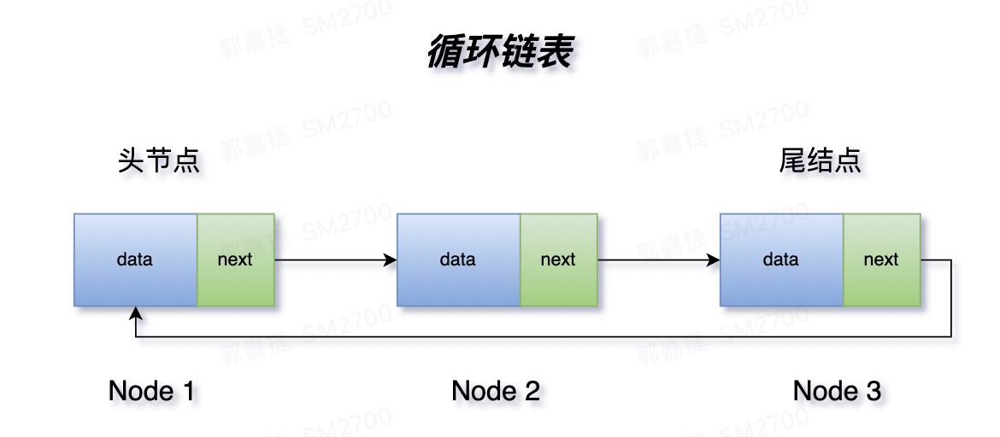
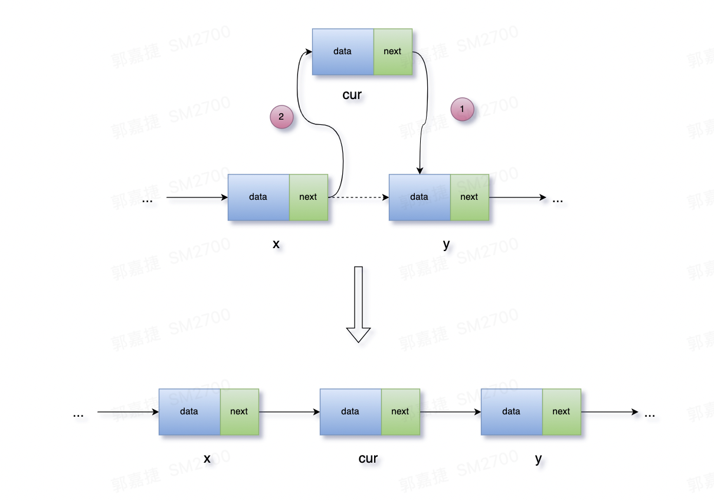
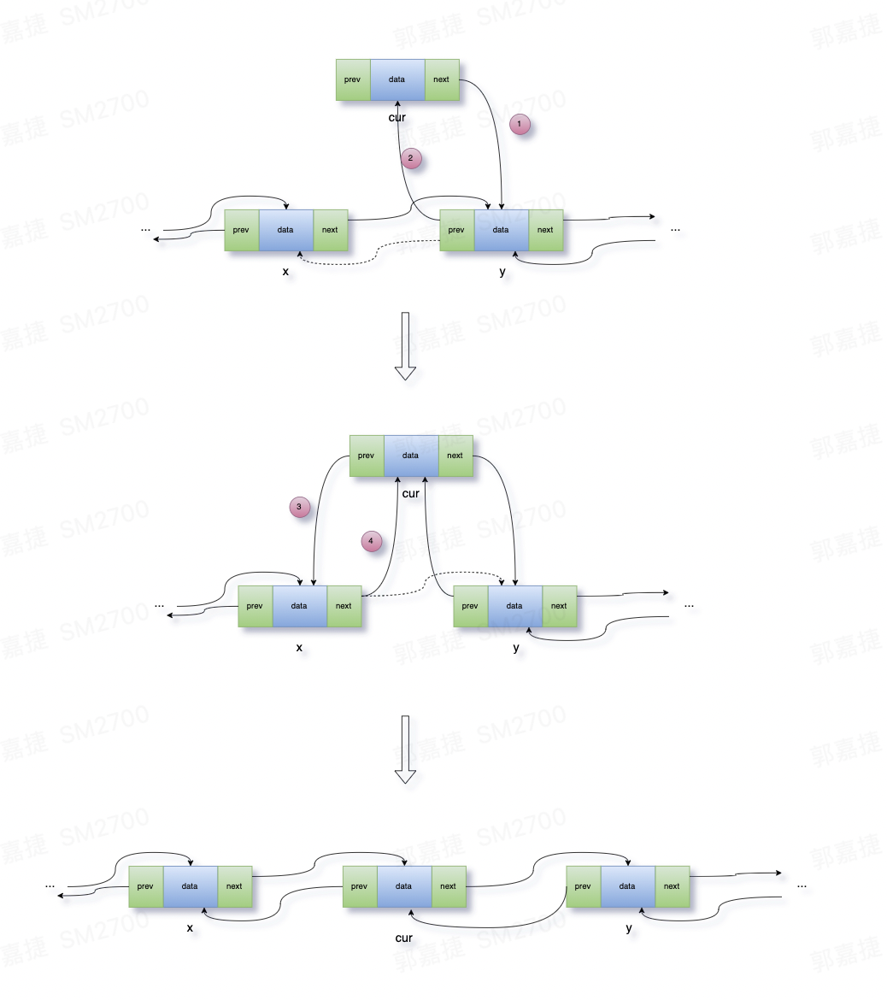

# 一、什么是链表？

链表是线性表的一种，主要由两部分构成，data 部分存放数据，next 是指向下个节点的指针，也叫做后继指针。通常，把第一个节点叫做头结点，最后一个节点叫做尾结点，尾节点的 next 指向 Null。

链表和数组都是很基础的数据结构，在底层存储上，链表就像一根针线一样，把分散的内存块串联起来了。

如图所示：




# 二、分类

除了单链表，还有比较复杂的双链表和循环链表

双链表，也叫双向链表，在单向链表的基础上，又多了一个前继指针 prev，来指向前一个节点。跟公路一样，有单行道和双行道的区别，单行道，交通规则简单，只能单向行驶，而双行道，规则会更加复杂。

如图所示：



循环链表，首尾相连，构成了一个环。




# 三、结构

单链表和双链表的结构如下，双链表的结构多了一个 prev 。

```java
public class ListNode {
	int val;
	ListNode next; // 后继指针
	ListNode(int val){
		this.val = val;
	}
}
```

```java
public class ListNode {
	int val;
	ListNode next; 
	ListNode prev;// 前继指针
	ListNode(int val){
		this.val = val;
	}
}
```

# 四、增删改查

单链表中，增加一个节点的，需要考虑哪些情况？

> 1、插入节点的 next 指向谁；
> 2、谁的 next 指向插入节点

如图所示：



代码如下：

```java
cur.next = x.next; // 第一步：当前节点的 next 指向 y
x.next = cur; // 第二步：x 的 next 指向当前节点
```

这里注意下，步骤反过来写可以吗？大家可以按照这个画一下，看会出现什么问题。

```java
x.next = cur; // 第一步：x 的 next 指向当前节点
cur.next = x.next; // 第二步：当前节点的 next 指向 y
```

双链表，增加一个节点，需要考虑哪些情况？从结构上可以看出，需要额外考虑 prev 指针

> 1、插入节点的 next，prev 指向谁；
> 2、谁的 next 指向插入节点；
> 3、谁的 prev 指向插入节点。

如图所示：



代码如下

```java
cur.next = x.next;
x.next.pre = cur; // 这两步处理的是 cur 和 y 的关系

x.next = cur;
cur.pre = x; // 这两部处理的是 cur 和 x 的关系
```

总的来说，链表操作的核心在于弄清节点之间的关系，关系是可枚举的，单链表的节点关系只有一种，就是谁是谁的后继指针，双链表多一个前继指针关系。


