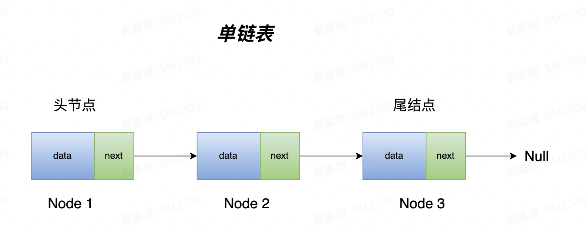

# 一、什么是链表？

链表跟数组一样，是线性结构的一种，主要由两部分组成，data 部分是数据，next 是指向下个节点的指针，第一个节点，通常叫做头结点，最后一个节点叫做尾结点，尾节点的 next 指向 Null。

链表和数组都是很基础的数据结构，在底层存储上，链表就像一根针线一样，把分散的内存块串联起来了。

如图所示：




# 二、分类

除了单链表，还有比较复杂的双链表和循环链表

# 二、特征

链表有两种常见类型，单向链表和双向链表

单链表的结构：

```java
public class ListNode {
	int val;
	ListNode next;
	ListNode(int val){
		this.val = val;
	}
}
```

```java
public class ListNode {
	int val;
	ListNode next;
	ListNode pre;
	ListNode(int val){
		this.val = val;
	}
}
```

双向链表多了一个 pre 引用，来标识跟前置节点的关系，用来往回检索

# 三、行为

操作上，来看看增删改查

```java
// 头插法
cur.next = head.next;
head.next = cur;
```

```java
// 尾插法
cur.next = tail.next
tail.next = cur;
```


3、指定位置删除节点


# 四、场景

1、链表翻转

```
public ListNode reverse(ListNode node){
	if (node == null) return node;
	
	ListNode dummyNode = new ListNode(-1);
	dummyNode.next = node;
	
	while (node.next != null) {
		ListNode cur = node.next;
		node.next = cur.next;
		cur.next = dummyNode.next;
		dummyNode.next = cur;
	}
}
```

2、指定区间翻转

```
public ListNode reverse(ListNode head, int m, int n){
	
}
```

3、每 k 个 翻转

```

```


# 五、技巧

## 虚拟节点

用途：减少边界条件的判断

命名：dummyNode

